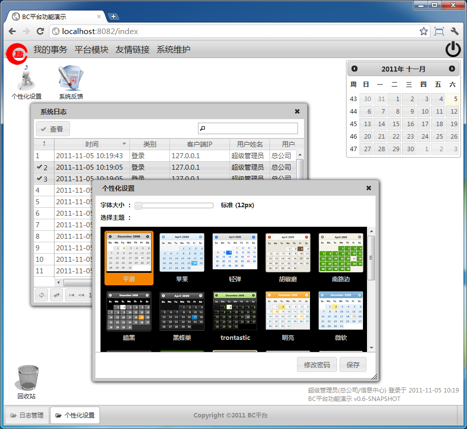

# [BC 平台](https://github.com/bcsoft/bc-framework)
基于 SSH/REST 框架的多窗口 Single Page Application。


## 1. 模块

Sn | 名称 | 备注
:---:|---|---
 1 | bc-framework-build  | 模块构建器，定义全局 properties 和 pluginManagement
 2 | bc-framework-bom    | 定义全局 dependencyManagement
 3 | bc-parent           | 所有子模块的父模块，定义全局 dependencies 和 plugins
 4 | bc-\[other-module\] | 其它子模块

Pom 继承结构 : (A : B 代表 B 是 A 的父模块)

```
bc-parent : bc-framework-bom : bc-framework-build
bc-\[other-module\] : bc-parent
```

## 2. 要求

Maven3.5+, Java8+.

## 3. 检出并编译源代码的步骤
1. 检出并安装[第三方依赖包](https://github.com/bcsoft/bc-3rd-party-jar)到本地 maven 仓库
    ```
    $ git clone https://github.com/bcsoft/bc-3rd-party-jar.git
    $ cd bc-3rd-party-jar
    $ ./3rd-party-jar_install2local.sh
    ```

2. 检出 BC 平台源码并编译安装
    ```
    $ git clone https://github.com/bcsoft/bc-framework.git
    $ cd bc-framework
    $ git submodule init
    $ git submodule update
    $ mvn clean install -D maven.test.skip=true
    ```

## 4. 开发环境构建

```shell
$ mvn clean install -D maven.test.skip=true
```

默认版本号是 `pom.xml/properties/revision` 的值，可以通过命令行指定其它值：

```shell
$ mvn clean install -D revision=x.y.z-SHAPSHOT
```

## 5. 版本发布

1. 修改 `pom.xml/properties/revision | bc-framework.version` 的值为要发布的版本号
    ```
    <properties>
      <revision>x.y.z</revision>
      <bc-framework.version>x.y.z</bc-framework.version>
    </properties>
    ```
2. 创建提交 `'Release version x.y.z'`.
    ```shell
    $ git add pom.xml
    $ git commit -m "Release version x.y.z"
    ```
3. 发布到内网的 nexus server.
    ```shell
    $ mvn clean deploy -P lan
    ```
4. 发布到 bintray.
    ```shell
    $ mvn clean deploy -P bintray
    ```
5. 发布到 sonatype.
    ```shell
    $ mvn clean deploy -P sonatype
    ```